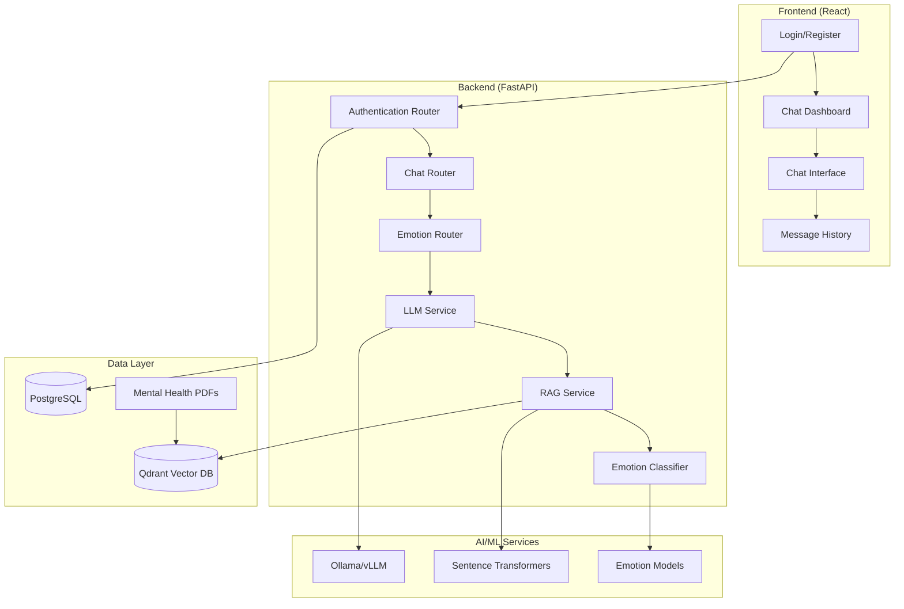

# MINDORA - Conversational Therapy Chatbot

## Project Overview

MINDORA is a comprehensive mental health chatbot application designed specifically for Rwandan youth. It combines advanced AI technologies including Retrieval-Augmented Generation (RAG), emotion classification, and local language models to provide culturally-sensitive mental health support.

## Architecture Overview



## Technology Stack

### Backend
- **Framework**: FastAPI (Python)
- **Database**: PostgreSQL
- **Vector Database**: Qdrant
- **LLM**: Ollama (LLaMA 3.1) / vLLM
- **Authentication**: JWT with bcrypt
- **ML/AI**: 
  - Sentence Transformers
  - LangChain
  - Transformers (HuggingFace)
  - Custom emotion classification

### Frontend
- **Framework**: React 18
- **Routing**: React Router DOM
- **Styling**: Tailwind CSS + Custom CSS
- **HTTP Client**: Axios
- **State Management**: React Hooks

### Infrastructure
- **Containerization**: Docker & Docker Compose
- **Services**: PostgreSQL, Qdrant, vLLM, Backend, Frontend

## Project Structure

```
mindora/
├── backend/                          # Python FastAPI backend
│   ├── app/
│   │   ├── __init__.py
│   │   ├── main.py                   # FastAPI application entry point
│   │   ├── auth/                     # Authentication module
│   │   │   ├── auth_router.py        # Auth endpoints (login, signup, conversations)
│   │   │   ├── emotion_router.py     # Emotion analysis endpoints
│   │   │   ├── schemas.py            # Pydantic models for validation
│   │   │   └── utils.py              # JWT, password hashing utilities
│   │   ├── db/                       # Database layer
│   │   │   ├── database.py           # SQLAlchemy configuration
│   │   │   └── models.py             # Database models (User, Conversation, Message, EmotionLog)
│   │   ├── routers/                  # API routers
│   │   │   └── chat_router.py        # Simple chat endpoint (legacy)
│   │   ├── services/                 # Core business logic
│   │   │   ├── llm_service_refactored.py # Refactored LLM service
│   │   │   ├── rag_service.py        # Document processing and embedding
│   │   │   ├── retriever_service.py  # Vector search service
│   │   │   ├── emotion_classifier.py # Emotion detection
│   │   │   ├── chatbot_insights_pipeline.py # Mental health analysis
│   │   │   └── mental_health_knowledge/ # Vector embeddings storage
│   │   ├── LifeActivities/           # Fitness emotion dataset analysis
│   │   │   └── fitlife_emotional_dataset.py
│   │   └── utils/                    # Utility functions
│   ├── Dockerfile                    # Backend container configuration
│   ├── Scrap.py                      # PDF scraping utility
│   └── mental_health_knowledge/      # Additional vector storage
├── test-frontend/                    # React frontend application
│   ├── public/                       # Static assets
│   ├── src/
│   │   ├── api/
│   │   │   └── api.js                # API client functions
│   │   ├── pages/
│   │   │   ├── Login.jsx             # Login page
│   │   │   ├── Register.jsx          # Registration page
│   │   │   ├── ChatList.jsx          # Conversation list (unused)
│   │   │   └── ChatDashboard.jsx     # Main chat interface
│   │   ├── App.js                    # Main React component with routing
│   │   ├── index.js                  # React entry point
│   │   └── index.css                 # Global styles with Tailwind
│   ├── Dockerfile                    # Frontend container configuration
│   └── package.json                  # Frontend dependencies
├── docker-compose.yml                # Multi-service orchestration
├── requirements.txt                  # Python dependencies
├── constraints.txt                   # Python version constraints
├── package.json                      # Root package.json (legacy)
└── README.md                         # Original project documentation
```

## Detailed Component Analysis

### Backend Services

#### 1. LLM Service (`backend/app/services/llm_service.py`)
**Purpose**: Core AI service managing language model interactions with safety guardrails.

**Key Features**:
- **Lifecycle Management**: Integrated with FastAPI's startup and shutdown events.
- **Multi-Provider Support**: Dynamically selects between `Ollama`, `vLLM`, `OpenAI`, and `Groq`.
- **Advanced Guardrails**: Utilizes NeMo Guardrails for content safety.
- **Cultural Context**: Integrates Rwanda-specific cultural nuances.
- **Emotion-Aware Responses**: Tailors responses based on detected emotions.

**Rwanda-Specific Features**:
- Ubuntu philosophy integration
- Local crisis resources (114 helpline, emergency services)
- Cultural healing approaches
- Community-centered support messaging

#### 2. RAG Service (`backend/app/services/rag_service.py`)
**Purpose**: Document processing and vector embedding for knowledge retrieval.

**Functionality**:
- **Lifecycle Integration**: Initialized on application startup via `initialize_rag_service()`.
- **PDF Processing**: Uses PyMuPDF to extract text from documents.
- **Text Chunking**: Employs `RecursiveCharacterTextSplitter` for semantic chunking.
- **Embedding Generation**: Processes embeddings in batches to optimize memory usage.
- **Vector DB Integration**: Upserts document chunks into Qdrant.

#### 3. Retriever Service (`backend/app/services/retriever_service.py`)
**Purpose**: Fast vector similarity search for contextual information retrieval.

**Features**:
- Cached query encoding for performance
- Optimized HNSW search parameters
- Model reuse across instances
- Sub-second search performance

#### 4. Emotion Classifier (`backend/app/services/emotion_classifier.py`)
**Purpose**: Real-time emotion detection from user messages.

**Capabilities**:
- **Lifecycle Integration**: Initialized on application startup via `initialize_emotion_classifier()`.
- **10 Emotion Categories**: sadness, anxiety, stress, fear, anger, guilt, craving, numbness, joy, neutral.
- **Model**: Utilizes the `BAAI/bge-small-en` embedding model.
- **Method**: Employs cosine similarity for classification.
- **Performance**: GPU acceleration and model caching.

#### 5. Mental Health Insights Pipeline (`backend/app/services/chatbot_insights_pipeline.py`)
**Purpose**: Comprehensive mental health signal detection and analysis.

**Analysis Features**:
- Medication mention detection
- Suicide risk assessment
- Emotion classification
- Sentiment analysis
- Toxicity detection
- Knowledge base integration

### Database Models

#### User Model
```python
class User(Base):
    id: Integer (Primary Key)
    username: Text (Not Null)
    email: Text (Unique, Not Null)
    password: Text (Hashed, Not Null)
    created_at: TIMESTAMP
    conversations: Relationship to Conversation
```

#### Conversation Model
```python
class Conversation(Base):
    id: Integer (Primary Key)
    user_id: Integer (Foreign Key to User)
    started_at: TIMESTAMP
    last_activity_at: TIMESTAMP
    user: Relationship to User
    messages: Relationship to Message (Cascade Delete)
```

#### Message Model
```python
class Message(Base):
    id: Integer (Primary Key)
    conversation_id: Integer (Foreign Key to Conversation)
    sender: String ("user" or "bot")
    content: Text (Message content)
    timestamp: TIMESTAMP
    conversation: Relationship to Conversation
```

#### EmotionLog Model
```python
class EmotionLog(Base):
    id: Integer (Primary Key)
    user_id: Integer (Foreign Key to User)
    conversation_id: Integer (Foreign Key to Conversation)
    input_text: Text (User message)
    detected_emotion: String (Classified emotion)
    timestamp: TIMESTAMP
```

### Frontend Components

#### 1. Authentication System
- **Login.jsx**: JWT-based authentication with automatic conversation routing
- **Register.jsx**: User registration with immediate chat creation
- **Token Management**: localStorage-based session management

#### 2. Chat Interface (`ChatDashboard.jsx`)
**Features**:
- Real-time messaging with optimistic updates
- Conversation sidebar with delete functionality
- Message history loading
- Typing indicators
- Emotion display (when detected)
- Responsive design with custom styling

#### 3. API Client (`api/api.js`)
**Endpoints**:
- Authentication: login, register
- Conversations: create, list, delete
- Messages: send, retrieve
- Context: fetch recent conversation history

### Security Features

#### 1. Input Sanitization
- HTML content cleaning with bleach
- Prompt injection prevention
- Length limitations
- Pattern-based filtering

#### 2. Authentication & Authorization
- JWT token-based authentication
- bcrypt password hashing
- Session expiration handling
- Route protection

#### 3. AI Safety Guardrails
- Content filtering for harmful outputs
- Crisis intervention responses
- Inappropriate relationship boundary enforcement
- Medical advice disclaimers
- Off-topic request handling

### Performance Optimizations

#### Backend
- Batch database operations
- Connection pooling
- Cached embeddings
- Optimized vector search
- Memory management for large documents

#### Frontend
- Optimistic UI updates
- Efficient re-rendering
- Local state management
- Debounced API calls

## Data Flow

### 1. User Message Processing Pipeline
```
User Input → Sanitization → Emotion Classification → RAG Retrieval → 
LLM Processing → Guardrails Check → Response Generation → Database Storage
```

### 2. Authentication Flow
```
Login Request → Credential Validation → JWT Generation → 
Conversation Retrieval → Dashboard Redirect
```

### 3. RAG Knowledge Retrieval
```
User Query → Query Embedding → Vector Search → 
Context Retrieval → Response Enhancement
```

## Setup and Deployment

### Prerequisites
- Docker & Docker Compose
- Python 3.10+
- Node.js 18+
- 8GB+ RAM (for ML models)
- GPU support (optional, for better performance)

### Environment Configuration

#### Docker Compose Services
1. **PostgreSQL**: Database on port 5100
2. **Qdrant**: Vector database on ports 6333/6334
3. **vLLM**: LLM service on port 8001 (optional)
4. **Backend**: FastAPI on port 8000
5. **Frontend**: React on port 3000

### Development Setup

1. **Clone Repository**
```bash
git clone <repository-url>
cd mindora
```

2. **Start Infrastructure Services**
```bash
docker-compose up postgres qdrant -d
```

3. **Backend Setup**
```bash
cd backend
pip install -r requirements.txt
uvicorn app.main:app --reload
```

4. **Frontend Setup**
```bash
cd test-frontend
npm install
npm start
```

5. **Initialize Knowledge Base**
```bash
cd backend/app/services
python rag_service.py
```

### Production Deployment
```bash
docker-compose up -d
```

## API Documentation

### Authentication Endpoints
- `POST /auth/signup` - User registration
- `POST /auth/login` - User authentication
- `POST /auth/conversations` - Create conversation
- `GET /auth/conversations` - List user conversations
- `GET /auth/conversations/{id}/messages` - Get conversation messages
- `POST /auth/messages` - Send message
- `DELETE /auth/conversations/{id}` - Delete conversation

### Analysis Endpoints
- `POST /emotion` - Detect emotion in text
- `POST /analyze` - Comprehensive mental health analysis
- `POST /detect/medications` - Extract medication mentions
- `POST /detect/suicide-risk` - Assess suicide risk

### Chat Endpoints
- `POST /api/chat` - Simple chat interface (legacy)

## Configuration

### Environment Variables
- `DATABASE_URL`: PostgreSQL connection string
- `OLLAMA_BASE_URL`: Ollama service URL
- `VLLM_BASE_URL`: vLLM service URL
- `SECRET_KEY`: JWT signing key
- `OLLAMA_MODEL`: Model name (default: llama3.1)

### Model Configuration
- **Embedding Model**: all-MiniLM-L6-v2
- **Emotion Model**: BAAI/bge-small-en
- **LLM Models**: LLaMA 3.1 (Ollama) / Meta-Llama-3-8B-Instruct (vLLM)

## Mental Health Features

### Crisis Intervention
- Automatic suicide risk detection
- Rwanda-specific crisis resources
- Emergency contact information
- Professional referral guidance

### Cultural Sensitivity
- Ubuntu philosophy integration
- Rwandan cultural context
- Community-centered healing approaches
- Local resource recommendations

### Therapeutic Approaches
- Emotion-aware responses
- Contextual conversation memory
- Evidence-based content integration
- Personalized support strategies

## Data Sources

The system processes mental health documents from:
- Rwanda Ministry of Health
- Rwanda Biomedical Center
- WHO mhGAP and Mental Health Atlas
- APA and SAMHSA publications
- PTSD, PHQ-9, GAD-7 screening tools
- Academic research articles

## Monitoring and Analytics

### Emotion Tracking
- Real-time emotion classification
- Conversation-level emotion logs
- User emotional journey tracking
- Trend analysis capabilities

### Usage Analytics
- Message volume tracking
- Response time monitoring
- User engagement metrics
- System performance monitoring

## Future Enhancements

### Planned Features
- Multi-language support (Kinyarwanda)
- Voice interaction capabilities
- Mobile application
- Therapist dashboard
- Advanced analytics dashboard
- Integration with healthcare systems

### Technical Improvements
- Model fine-tuning for Rwandan context
- Enhanced RAG with domain-specific models
- Real-time streaming responses
- Advanced caching strategies
- Microservices architecture

## Contributing

### Development Guidelines
1. Follow Python PEP 8 style guide
2. Use TypeScript for new frontend components
3. Write comprehensive tests
4. Document all API changes
5. Ensure cultural sensitivity in all content

### Testing
- Unit tests for core services
- Integration tests for API endpoints
- Frontend component testing
- End-to-end user journey testing

## License and Ethics

### Ethical Considerations
- User privacy protection
- Data anonymization
- Consent management
- Professional boundary maintenance
- Crisis intervention protocols

### Data Privacy
- GDPR compliance considerations
- Local data storage requirements
- User data deletion capabilities
- Audit trail maintenance

## Support and Maintenance

### System Requirements
- Regular model updates
- Knowledge base refresh
- Security patch management
- Performance optimization
- User feedback integration

### Contact Information
- Technical Support: [Contact Information]
- Mental Health Resources: 114 (Rwanda Mental Health Helpline)
- Emergency Services: 112

---

**Note**: This system is designed to provide supportive mental health conversations but is not a replacement for professional mental health care. Users experiencing crisis situations should contact emergency services or professional mental health providers immediately.