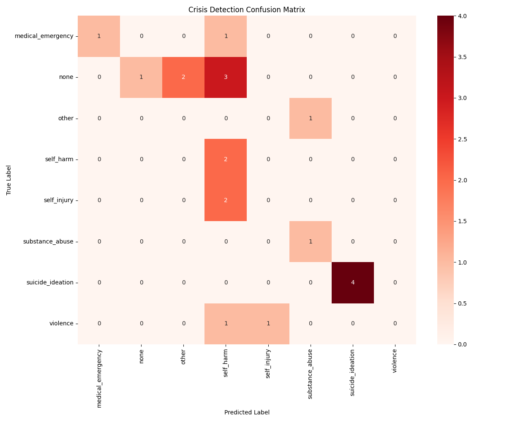
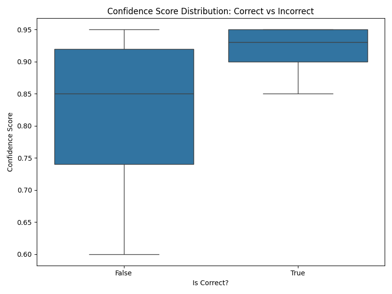
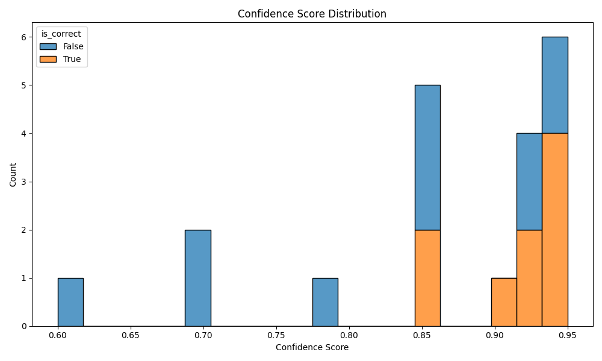
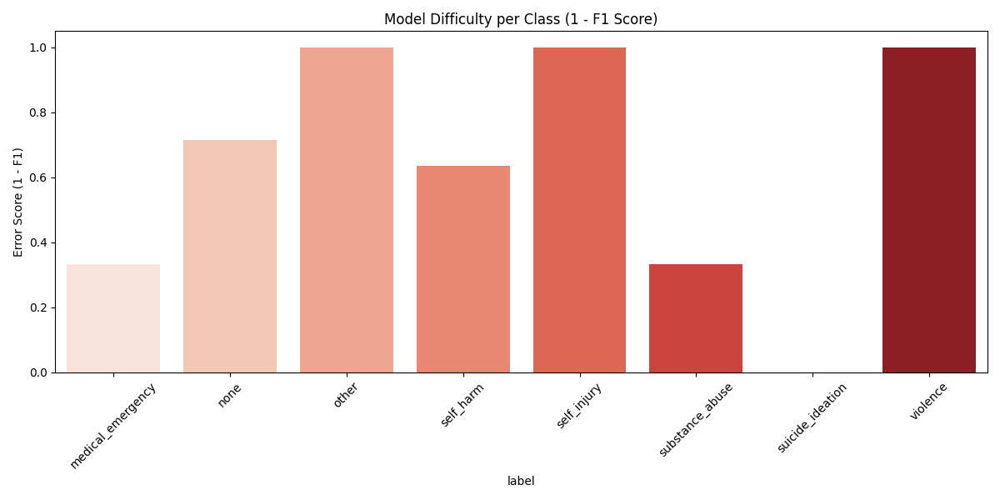
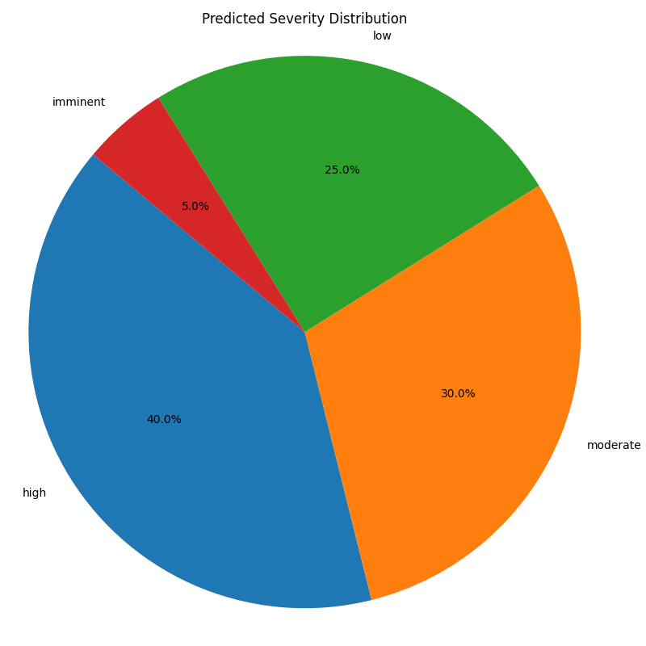
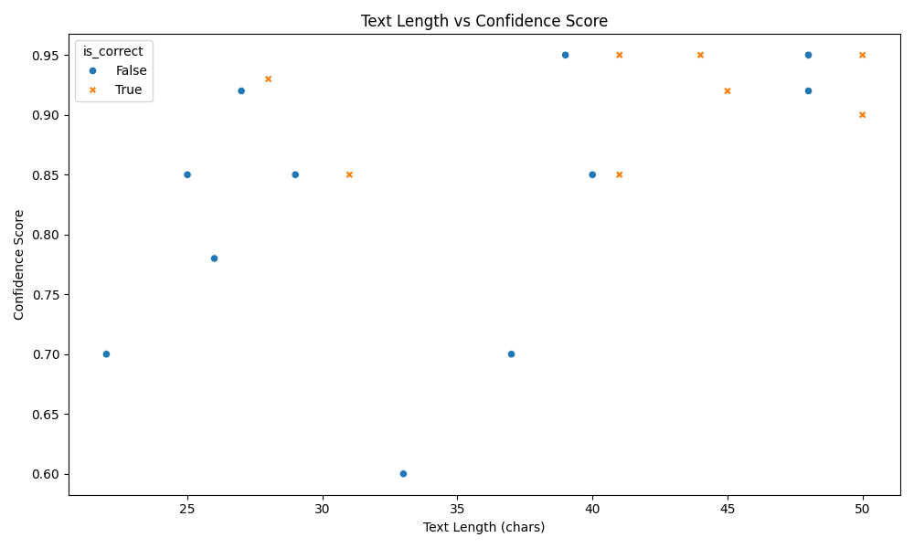

# Crisis Detection Experiment Report

## 1. Binary Crisis Detection (Crisis vs None)
- **Accuracy**: 0.7500
- **Precision**: 0.7368
- **Recall**: 1.0000
- **F1-Score**: 0.8485
- **Confusion Matrix**: TP=14, FP=5, FN=0, TN=1

## 2. Detailed Class-wise Metrics
- **Overall Accuracy**: 0.4500
- **Macro F1-Score**: 0.3728

| Label | Precision | Recall | F1-Score | Support |
|---|---|---|---|---|
| medical_emergency | 1.0000 | 0.5000 | 0.6667 | 2 |
| none | 1.0000 | 0.1667 | 0.2857 | 6 |
| other | 0.0000 | 0.0000 | 0.0000 | 1 |
| self_harm | 0.2222 | 1.0000 | 0.3636 | 2 |
| self_injury | 0.0000 | 0.0000 | 0.0000 | 2 |
| substance_abuse | 0.5000 | 1.0000 | 0.6667 | 1 |
| suicide_ideation | 1.0000 | 1.0000 | 1.0000 | 4 |
| violence | 0.0000 | 0.0000 | 0.0000 | 2 |

## 3. Confusion Matrix

| True \ Pred | medical_emergency | none | other | self_harm | self_injury | substance_abuse | suicide_ideation | violence |
|---|---|---|---|---|---|---|---|---|
| **medical_emergency** | 1 | 0 | 0 | 1 | 0 | 0 | 0 | 0 |
| **none** | 0 | 1 | 2 | 3 | 0 | 0 | 0 | 0 |
| **other** | 0 | 0 | 0 | 0 | 0 | 1 | 0 | 0 |
| **self_harm** | 0 | 0 | 0 | 2 | 0 | 0 | 0 | 0 |
| **self_injury** | 0 | 0 | 0 | 2 | 0 | 0 | 0 | 0 |
| **substance_abuse** | 0 | 0 | 0 | 0 | 0 | 1 | 0 | 0 |
| **suicide_ideation** | 0 | 0 | 0 | 0 | 0 | 0 | 4 | 0 |
| **violence** | 0 | 0 | 0 | 1 | 1 | 0 | 0 | 0 |

## 4. Visualizations
### Metrics

### Confidence Analysis

### Error Analysis

### Severity Analysis

## 5. Error Analysis
### Misclassified Examples
**1. Text**: "I cut myself again last night to feel something."
   - **True**: self_injury
   - **Predicted**: self_harm
   - **Severity**: moderate
   - **Confidence**: 0.9200

**2. Text**: "I'm going to hurt him if he comes near me again."
   - **True**: violence
   - **Predicted**: self_harm
   - **Severity**: high
   - **Confidence**: 0.9500

**3. Text**: "I failed my exam and I'm so stressed."
   - **True**: none
   - **Predicted**: self_harm
   - **Severity**: low
   - **Confidence**: 0.7000

**4. Text**: "My friend is acting weird lately."
   - **True**: none
   - **Predicted**: other
   - **Severity**: low
   - **Confidence**: 0.6000

**5. Text**: "Burning myself is the only way to cope."
   - **True**: self_injury
   - **Predicted**: self_harm
   - **Severity**: high
   - **Confidence**: 0.9500

**6. Text**: "I took too many painkillers by accident."
   - **True**: medical_emergency
   - **Predicted**: self_harm
   - **Severity**: moderate
   - **Confidence**: 0.8500

**7. Text**: "I hate my job so much."
   - **True**: none
   - **Predicted**: self_harm
   - **Severity**: low
   - **Confidence**: 0.7000

**8. Text**: "He hit me and I'm bleeding."
   - **True**: violence
   - **Predicted**: self_injury
   - **Severity**: high
   - **Confidence**: 0.9200

**9. Text**: "I need help with my homework."
   - **True**: none
   - **Predicted**: other
   - **Severity**: low
   - **Confidence**: 0.8500

**10. Text**: "I'm addicted to gambling."
   - **True**: other
   - **Predicted**: substance_abuse
   - **Severity**: moderate
   - **Confidence**: 0.8500
