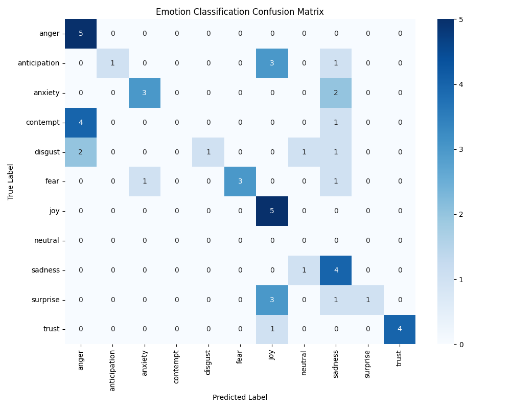
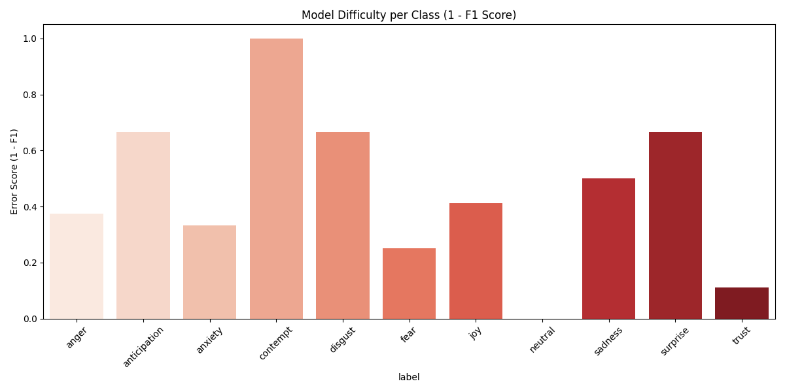
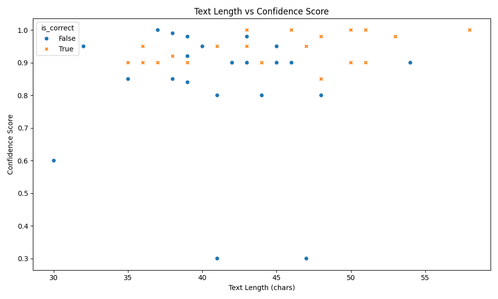

# Capstone Project Experiment Report

## 1. Experimental Results Summary
- **Total Samples**: 50
- **Accuracy**: 0.5400
- **Macro Precision**: 0.6350
- **Macro Recall**: 0.4909
- **Macro F1-Score**: 0.4563

## 2. Class-wise Metrics
| Label | Precision | Recall | F1-Score | Support |
|---|---|---|---|---|
| anger | 0.4545 | 1.0000 | 0.6250 | 5 |
| anticipation | 1.0000 | 0.2000 | 0.3333 | 5 |
| anxiety | 0.7500 | 0.6000 | 0.6667 | 5 |
| contempt | 0.0000 | 0.0000 | 0.0000 | 5 |
| disgust | 1.0000 | 0.2000 | 0.3333 | 5 |
| fear | 1.0000 | 0.6000 | 0.7500 | 5 |
| joy | 0.4167 | 1.0000 | 0.5882 | 5 |
| neutral | 0.0000 | 0.0000 | 0.0000 | 0 |
| sadness | 0.3636 | 0.8000 | 0.5000 | 5 |
| surprise | 1.0000 | 0.2000 | 0.3333 | 5 |
| trust | 1.0000 | 0.8000 | 0.8889 | 5 |

## 3. Confusion Matrix

| True \ Pred | anger | anticipation | anxiety | contempt | disgust | fear | joy | neutral | sadness | surprise | trust |
|---|---|---|---|---|---|---|---|---|---|---|---|
| **anger** | 5 | 0 | 0 | 0 | 0 | 0 | 0 | 0 | 0 | 0 | 0 |
| **anticipation** | 0 | 1 | 0 | 0 | 0 | 0 | 3 | 0 | 1 | 0 | 0 |
| **anxiety** | 0 | 0 | 3 | 0 | 0 | 0 | 0 | 0 | 2 | 0 | 0 |
| **contempt** | 4 | 0 | 0 | 0 | 0 | 0 | 0 | 0 | 1 | 0 | 0 |
| **disgust** | 2 | 0 | 0 | 0 | 1 | 0 | 0 | 1 | 1 | 0 | 0 |
| **fear** | 0 | 0 | 1 | 0 | 0 | 3 | 0 | 0 | 1 | 0 | 0 |
| **joy** | 0 | 0 | 0 | 0 | 0 | 0 | 5 | 0 | 0 | 0 | 0 |
| **neutral** | 0 | 0 | 0 | 0 | 0 | 0 | 0 | 0 | 0 | 0 | 0 |
| **sadness** | 0 | 0 | 0 | 0 | 0 | 0 | 0 | 1 | 4 | 0 | 0 |
| **surprise** | 0 | 0 | 0 | 0 | 0 | 0 | 3 | 0 | 1 | 1 | 0 |
| **trust** | 0 | 0 | 0 | 0 | 0 | 0 | 1 | 0 | 0 | 0 | 4 |

## 4. Visualizations
### Metrics

### Confidence Analysis

### Error Analysis

### Additional Analysis

## 5. Error Analysis
### Misclassified Examples
**1. Text**: "The news of the accident was devastating."
   - **True**: sadness
   - **Predicted**: neutral
   - **Confidence**: 0.3000

**2. Text**: "I'm scared that I won't be able to pay the rent."
   - **True**: fear
   - **Predicted**: sadness
   - **Confidence**: 0.8000

**3. Text**: "The thought of public speaking gives me panic attacks."
   - **True**: fear
   - **Predicted**: anxiety
   - **Confidence**: 0.9000

**4. Text**: "I can't stand the sight of cockroaches."
   - **True**: disgust
   - **Predicted**: anger
   - **Confidence**: 0.9200

**5. Text**: "His behavior at the dinner table was repulsive."
   - **True**: disgust
   - **Predicted**: neutral
   - **Confidence**: 0.3000

**6. Text**: "The food was spoiled and made me sick."
   - **True**: disgust
   - **Predicted**: sadness
   - **Confidence**: 0.8500

**7. Text**: "I am disgusted by their lack of empathy."
   - **True**: disgust
   - **Predicted**: anger
   - **Confidence**: 0.9500

**8. Text**: "I wasn't expecting a package today!"
   - **True**: surprise
   - **Predicted**: joy
   - **Confidence**: 0.8500

**9. Text**: "Wow, I didn't know you could play the piano."
   - **True**: surprise
   - **Predicted**: joy
   - **Confidence**: 0.8000

**10. Text**: "It was a shock to hear they are moving away."
   - **True**: surprise
   - **Predicted**: sadness
   - **Confidence**: 0.8000
